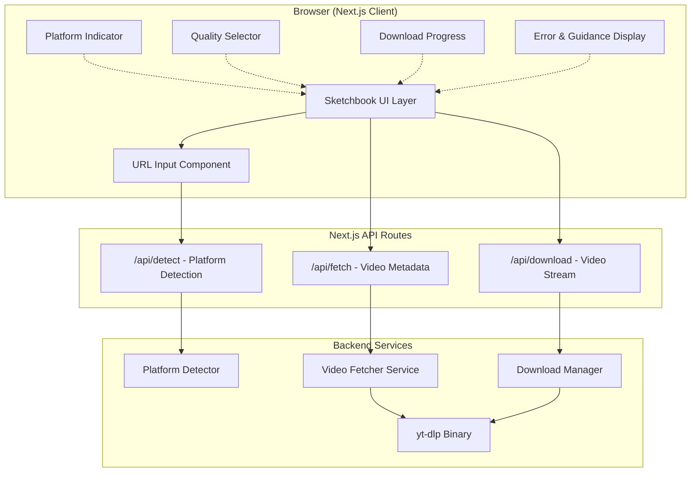
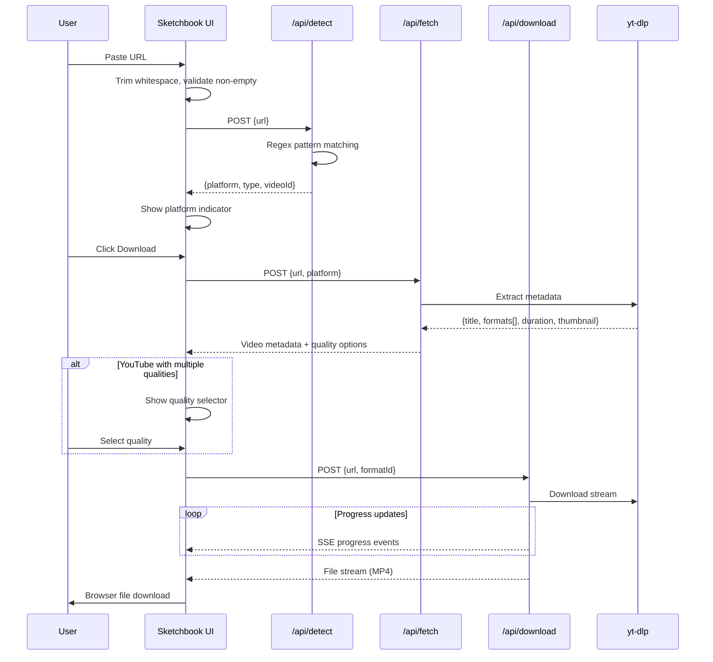
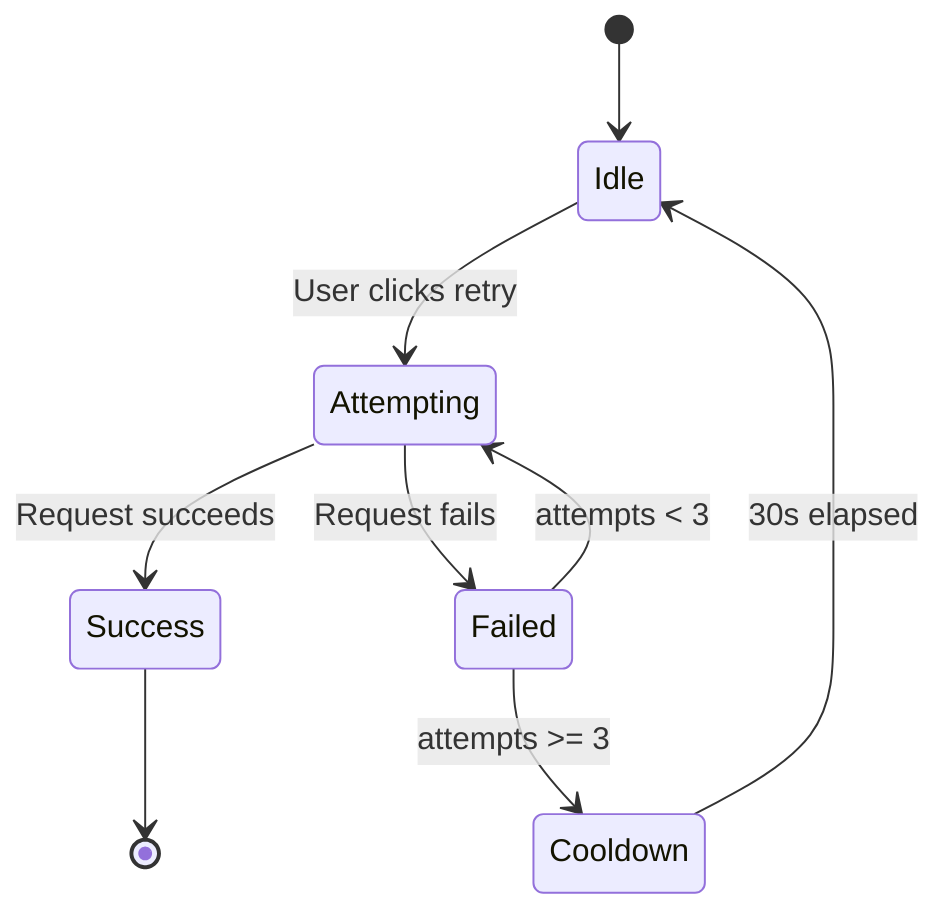

# Design Document: Video Downloader Site

## Overview

This design describes a video downloader web application with a sketchbook-style aesthetic that supports downloading videos from Instagram (posts and Reels) and YouTube (videos and Shorts). The application is built as a Next.js full-stack application with a Node.js backend that wraps `yt-dlp` for video extraction and uses server-side scraping for Instagram content.

### Key Design Decisions

1. **Next.js 16.2 (App Router)** — Provides both the frontend React UI and API routes for the backend, simplifying deployment and development.
2. **yt-dlp via `youtube-dl-exec`** — Battle-tested video extraction tool that handles YouTube's constantly changing APIs. The Node.js wrapper `youtube-dl-exec` provides a clean interface.
3. **Instagram scraping via yt-dlp** — yt-dlp also supports Instagram video extraction, providing a unified backend approach for both platforms.
4. **Rough.js + RoughNotation** — Libraries that render hand-drawn, sketchy SVG graphics for borders, annotations, and decorative elements, achieving the sketchbook aesthetic without custom artwork.
5. **Tailwind CSS** — Utility-first CSS framework for responsive layout and custom theming with the warm pastel color palette.
6. **Google Fonts (Caveat + Nunito)** — Caveat for handwritten headings, Nunito for readable body text — both free and web-optimized.

### Research Findings

- **yt-dlp** is the most reliable tool for extracting video from both YouTube and Instagram. It handles rate limiting, format selection, and metadata extraction. The `youtube-dl-exec` npm package provides a stable Node.js wrapper.
- **Rough.js** (<9kB gzipped) renders sketchy SVG primitives (lines, rectangles, circles, ellipses) that look hand-drawn. Combined with **RoughNotation** for text annotations, this achieves the doodle aesthetic programmatically.
- **Instagram scraping** is increasingly difficult due to anti-bot measures. yt-dlp handles this by emulating browser requests and managing cookies. For public content, no authentication is needed.
- **Sketchbook UI** component libraries exist (e.g., wired-elements, Sketchbook UI for React) but Rough.js with custom components gives more control over the specific warm, heartwarming aesthetic required.

## Architecture



### Request Flow



## Components and Interfaces

### Frontend Components

#### `URLInputField`
The primary input component with sketchbook styling.

```typescript
interface URLInputFieldProps {
  onSubmit: (url: string) => void;
  isLoading: boolean;
  error?: string;
  detectedPlatform?: Platform;
}
```

#### `PlatformIndicator`
Displays detected platform with hand-drawn icon.

```typescript
interface PlatformIndicatorProps {
  platform: 'instagram' | 'youtube';
  contentType: 'post' | 'reel' | 'video' | 'short';
}
```

#### `QualitySelector`
Quality selection for YouTube videos with sketchbook-styled radio buttons.

```typescript
interface QualitySelectorProps {
  options: VideoQuality[];
  onSelect: (formatId: string) => void;
  selectedId?: string;
}

interface VideoQuality {
  formatId: string;
  resolution: string; // e.g., "1080p", "720p"
  fileSize: number;   // approximate bytes
  label: string;      // e.g., "1080p HD (~45MB)"
}
```

#### `DownloadProgress`
Animated progress indicator with sketchbook-style fill animation.

```typescript
interface DownloadProgressProps {
  percentage: number; // 0-100
  status: 'downloading' | 'complete' | 'error';
  onRetry?: () => void;
}
```

#### `SketchCharacter`
Illustrated character/doodle that changes appearance based on state.

```typescript
interface SketchCharacterProps {
  mood: 'idle' | 'thinking' | 'happy' | 'sad' | 'error';
}
```

#### `ErrorMessage`
Friendly error display with illustrations and guidance.

```typescript
interface ErrorMessageProps {
  type: 'network' | 'private' | 'unavailable' | 'unsupported' | 'timeout' | 'rate-limit' | 'duration' | 'format';
  message: string;
  retryAction?: () => void;
  retryDisabled?: boolean;
  countdown?: number;
}
```

#### `HelpSection`
Step-by-step instructions with example URLs and illustrations.

```typescript
interface HelpSectionProps {
  platforms: PlatformExample[];
}

interface PlatformExample {
  name: string;
  icon: React.ReactNode;
  exampleUrls: string[];
  steps: string[];
}
```

### Backend API Interfaces

#### `POST /api/detect`

```typescript
// Request
interface DetectRequest {
  url: string;
}

// Response
interface DetectResponse {
  platform: 'instagram' | 'youtube';
  contentType: 'post' | 'reel' | 'video' | 'short';
  videoId: string;
  normalizedUrl: string;
}

// Error Response
interface DetectErrorResponse {
  error: string;
  code: 'UNSUPPORTED_PLATFORM' | 'INVALID_FORMAT' | 'EMPTY_URL' | 'TIMEOUT';
  supportedPlatforms: string[];
  exampleFormats?: string[];
}
```

#### `POST /api/fetch`

```typescript
// Request
interface FetchRequest {
  url: string;
  platform: 'instagram' | 'youtube';
}

// Response
interface FetchResponse {
  title: string;
  thumbnail?: string;
  duration: number; // seconds
  formats: VideoFormat[];
}

interface VideoFormat {
  formatId: string;
  resolution: string;
  fileSize: number;
  ext: string;
  quality: string;
}

// Error Response
interface FetchErrorResponse {
  error: string;
  code: 'PRIVATE' | 'UNAVAILABLE' | 'AGE_RESTRICTED' | 'GEO_BLOCKED' | 'DURATION_EXCEEDED' | 'RATE_LIMITED' | 'NETWORK_ERROR';
  retryAfter?: number; // seconds, for rate limiting
}
```

#### `POST /api/download`

```typescript
// Request
interface DownloadRequest {
  url: string;
  formatId: string;
}

// Response: Server-Sent Events stream for progress, then file stream
// SSE events:
interface ProgressEvent {
  type: 'progress';
  percentage: number; // 0-100
}

interface CompleteEvent {
  type: 'complete';
  filename: string;
  size: number;
}

interface ErrorEvent {
  type: 'error';
  code: string;
  message: string;
}
```

### Backend Services

#### `PlatformDetector`

```typescript
class PlatformDetector {
  detect(url: string): DetectResult | null;
  normalize(url: string): string;
  extractVideoId(url: string, platform: Platform): string | null;
}

interface DetectResult {
  platform: 'instagram' | 'youtube';
  contentType: 'post' | 'reel' | 'video' | 'short';
  videoId: string;
  normalizedUrl: string;
}
```

#### `VideoFetcher`

```typescript
class VideoFetcher {
  fetchMetadata(url: string, platform: Platform): Promise<VideoMetadata>;
  private executeYtDlp(args: string[]): Promise<YtDlpOutput>;
}

interface VideoMetadata {
  title: string;
  duration: number;
  thumbnail: string;
  formats: VideoFormat[];
}
```

#### `DownloadManager`

```typescript
class DownloadManager {
  download(url: string, formatId: string, onProgress: (pct: number) => void): ReadableStream;
}
```

## Data Models

### URL Pattern Definitions

```typescript
const URL_PATTERNS = {
  instagram: {
    post: /^https?:\/\/(www\.)?instagram\.com\/p\/([A-Za-z0-9_-]+)\/?/,
    reel: /^https?:\/\/(www\.)?instagram\.com\/reels?\/([A-Za-z0-9_-]+)\/?/,
  },
  youtube: {
    video: /^https?:\/\/(www\.|m\.)?youtube\.com\/watch\?v=([A-Za-z0-9_-]{11})/,
    short: /^https?:\/\/(www\.|m\.)?youtube\.com\/shorts\/([A-Za-z0-9_-]{11})/,
    shortUrl: /^https?:\/\/youtu\.be\/([A-Za-z0-9_-]{11})/,
  },
} as const;
```

### Application State

```typescript
interface AppState {
  url: string;
  detection: DetectionState;
  fetch: FetchState;
  download: DownloadState;
}

type DetectionState =
  | { status: 'idle' }
  | { status: 'detecting' }
  | { status: 'detected'; result: DetectResult }
  | { status: 'error'; error: DetectErrorResponse };

type FetchState =
  | { status: 'idle' }
  | { status: 'fetching' }
  | { status: 'fetched'; metadata: VideoMetadata }
  | { status: 'error'; error: FetchErrorResponse };

type DownloadState =
  | { status: 'idle' }
  | { status: 'downloading'; percentage: number }
  | { status: 'complete'; filename: string }
  | { status: 'error'; error: string; retryCount: number };
```

### Design Tokens (Sketchbook Theme)

```typescript
const sketchbookTheme = {
  colors: {
    background: '#FFF8F0',      // Warm cream
    surface: '#FFFDF9',         // Slightly lighter cream
    primary: '#E8785A',         // Warm coral
    secondary: '#7BB5A3',       // Soft sage green
    accent: '#F4C06F',          // Muted golden yellow
    text: '#3D3229',            // Warm dark brown
    textMuted: '#8B7B6B',       // Soft brown
    error: '#D4574E',           // Muted red
    success: '#6BA87B',         // Soft green
    border: '#C4B5A4',          // Warm tan
  },
  fonts: {
    heading: "'Caveat', cursive",
    body: "'Nunito', sans-serif",
  },
  borderRadius: '4px',          // Slight rounding, rough.js handles sketch effect
  animation: {
    micro: '200ms ease-in-out',
    standard: '300ms ease-in-out',
    slow: '400ms ease-in-out',
  },
  breakpoints: {
    mobile: '768px',
    tablet: '1024px',
  },
} as const;
```

### Retry State

```typescript
interface RetryState {
  attempts: number;
  maxAttempts: 3;
  cooldownSeconds: 30;
  cooldownEndTime?: number; // Unix timestamp
  isDisabled: boolean;
}
```

## Correctness Properties

*A property is a characteristic or behavior that should hold true across all valid executions of a system — essentially, a formal statement about what the system should do. Properties serve as the bridge between human-readable specifications and machine-verifiable correctness guarantees.*

### Property 1: URL Detection Correctness

*For any* valid URL belonging to a supported platform (Instagram post, Instagram Reel, YouTube video, YouTube Short, or youtu.be short link), the Platform_Detector SHALL correctly identify the platform, content type, and extract the video identifier.

**Validates: Requirements 1.2, 2.1, 2.2, 3.1, 3.2, 6.1, 6.2**

### Property 2: URL Normalization Invariance

*For any* valid video URL, adding arbitrary leading/trailing whitespace, appending additional query parameters (e.g., utm_source, igshid, si), changing the scheme between http and https, adding or removing the www subdomain, or adding or removing a trailing slash SHALL all produce the same detected platform, content type, and video identifier as the canonical URL.

**Validates: Requirements 6.3, 6.4, 6.5**

### Property 3: Invalid URL Rejection

*For any* string that is either (a) composed entirely of whitespace characters, (b) a URL on a supported platform domain that does not contain a valid video identifier path, or (c) a URL from an unsupported domain, the Platform_Detector SHALL return an error result and never produce a successful detection.

**Validates: Requirements 1.4, 1.6, 2.5, 6.6**

### Property 4: Quality Options Ordering

*For any* list of video quality options returned by the Video_Fetcher, the Downloader_App SHALL present them sorted from highest resolution to lowest resolution, such that for every adjacent pair (i, i+1) in the displayed list, the resolution of item i is greater than or equal to the resolution of item i+1.

**Validates: Requirements 3.3**

### Property 5: Duration Boundary Enforcement

*For any* video metadata with a duration value, the system SHALL accept videos with duration ≤ 3600 seconds (60 minutes) and reject videos with duration > 3600 seconds, with no false acceptances or rejections at the boundary.

**Validates: Requirements 3.7**

### Property 6: Error Code to Restriction Message Mapping

*For any* error code returned by the Video_Fetcher (from the set: PRIVATE, AGE_RESTRICTED, GEO_BLOCKED, UNAVAILABLE), the Downloader_App SHALL map it to a distinct, specific user-facing message that names the restriction type, and no two different error codes SHALL produce the same message.

**Validates: Requirements 3.6**

### Property 7: Progress Value Invariant

*For any* progress update emitted by the Download_Manager during a download, the value SHALL be an integer in the range [0, 100] inclusive, and successive progress values SHALL be monotonically non-decreasing.

**Validates: Requirements 4.2**

### Property 8: Color Contrast Accessibility

*For any* text/background color combination defined in the Sketchbook theme, the computed contrast ratio SHALL be at least 4.5:1 for normal text (below 18.66px bold or 24px regular) and at least 3:1 for large text.

**Validates: Requirements 5.2**

### Property 9: Animation Duration Bounds

*For any* micro-animation defined on interactive elements in the Sketchbook_UI, the animation duration SHALL be between 150ms and 400ms inclusive.

**Validates: Requirements 5.4**

## Error Handling

### Error Categories and User Experience

| Error Type | Trigger | User-Facing Message | Visual | Action |
|---|---|---|---|---|
| Empty URL | Whitespace-only input | "Please paste a video URL to get started!" | Sketch character looks confused | Focus input field |
| Unsupported Platform | URL from unknown domain | "We don't recognize this URL. We support Instagram and YouTube!" | Sketch character shrugs | Show example URLs |
| Invalid Format | Supported domain, bad path | "This doesn't look like a video link. Check the URL?" | Sketch character points at examples | Show format examples |
| Detection Timeout | >1s detection time | "That took too long! Try pasting the URL again." | Sketch character taps watch | Clear and refocus input |
| Private Content | Instagram private post | "This content is private — we can only download public videos." | Sketch character behind locked door | Suggest alternatives |
| Age Restricted | YouTube age-gated | "This video is age-restricted and can't be downloaded." | Sketch character with stop sign | — |
| Geo Blocked | YouTube geo-restriction | "This video isn't available in your region." | Sketch character with map | — |
| Content Unavailable | Deleted/expired content | "This content is no longer available on the platform." | Sad sketch character | Preserve URL in input |
| Network Error | Connection failure | "Couldn't connect — check your internet and try again!" | Sad cloud doodle | Retry button |
| Rate Limited | Platform throttling | "Too many requests! Please wait {countdown}..." | Sketch character waiting | Countdown timer |
| Duration Exceeded | Video > 60 min | "This video is too long! We support videos up to 60 minutes." | Sketch character measuring | — |
| Download Timeout | No progress for 30s | "Download seems stuck. Want to try again?" | Sketch character confused | Retry button |
| Download Failure | Mid-download error | "Something went wrong during download." | Sad sketch character | Retry with same settings |

### Retry Strategy



- **Max retries**: 3 consecutive attempts before cooldown
- **Cooldown period**: 30 seconds (displayed as countdown)
- **Retry preserves**: Original URL and selected quality settings
- **Rate limit cooldown**: Uses platform-provided `retry-after` header, defaults to 60 seconds

### Error Propagation

1. **yt-dlp errors** are caught by VideoFetcher and mapped to typed error codes
2. **API route errors** return structured JSON with error code and user-friendly message
3. **Client-side errors** (network, timeout) are caught by fetch wrappers and mapped to UI error states
4. **All errors** preserve the user's input URL in the text field

## Testing Strategy

### Property-Based Testing

**Library**: [fast-check](https://github.com/dubzzz/fast-check) (TypeScript property-based testing library)

**Configuration**:
- Minimum 100 iterations per property test
- Each test tagged with: `Feature: video-downloader-site, Property {N}: {title}`

**Properties to implement**:

| Property | Target Function | Generator Strategy |
|---|---|---|
| 1: URL Detection | `PlatformDetector.detect()` | Generate valid URLs from templates with random shortcodes/IDs |
| 2: URL Normalization | `PlatformDetector.detect()` | Take valid URLs and apply random transformations (whitespace, params, scheme) |
| 3: Invalid URL Rejection | `PlatformDetector.detect()` | Generate invalid URLs (whitespace strings, bad paths, unsupported domains) |
| 4: Quality Ordering | `sortQualities()` | Generate random arrays of VideoQuality objects |
| 5: Duration Boundary | `checkDuration()` | Generate random integers around the 3600-second boundary |
| 6: Error Code Mapping | `mapErrorToMessage()` | Generate from enum of error codes |
| 7: Progress Invariant | `DownloadManager` progress events | Generate sequences of progress values |
| 8: Color Contrast | Theme color pairs | Enumerate all theme color combinations |
| 9: Animation Duration | Theme animation values | Enumerate all animation definitions |

### Unit Testing

**Framework**: Vitest (fast, TypeScript-native, compatible with Next.js)

**Focus areas**:
- Specific URL examples for each supported format (example-based)
- Error message content verification
- Component rendering states (idle, loading, success, error)
- Timeout behavior (mocked timers)
- Retry state machine transitions
- Help section content completeness

### Integration Testing

**Framework**: Playwright (for E2E browser testing)

**Focus areas**:
- Full download flow with mocked yt-dlp responses
- Responsive layout at 360px, 768px, 1024px, 1440px viewports
- Accessibility: keyboard navigation, screen reader labels, reduced-motion
- Progress indicator animation timing
- File download trigger in browser

### Visual Testing

- Snapshot tests for sketchbook component styling
- Visual regression for Rough.js rendered elements
- Responsive layout screenshots at each breakpoint

