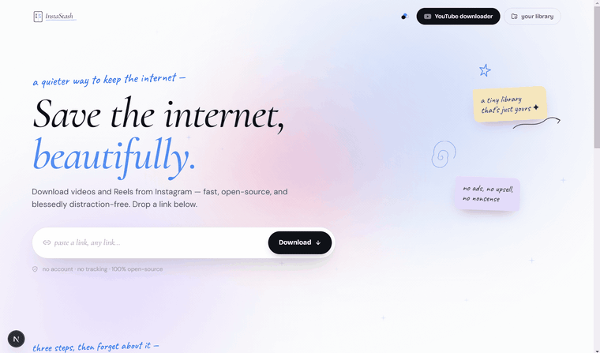

<div align="center">

# 📔 InstaStash

### A simple, beautiful desktop app for saving Instagram videos and reels.

Paste a link → choose the quality → the video saves straight to your computer.
No ads, no pop-ups, no sign-up, no shady websites.

[](https://github.com/xcyberpunkx0/InstaStash/actions/workflows/release.yml)




</div>

---

## 📖 Table of contents

1. [What is this?](#-what-is-this)
2. [What can it do?](#-what-can-it-do)
3. [How to install and use it (the easy way)](#-how-to-install-and-use-it-the-easy-way)
4. [How does it actually work?](#-how-does-it-actually-work)
5. [Run it yourself from the source code](#-run-it-yourself-from-the-source-code)
6. [Building your own installer](#-building-your-own-installer)
7. [What's inside the project (folder map)](#-whats-inside-the-project-folder-map)
8. [The tools it's built with](#-the-tools-its-built-with)
9. [Frequently asked questions](#-frequently-asked-questions)
10. [Legal & responsible use](#-legal--responsible-use)

---

## 🤔 What is this?

**InstaStash is a program you install on your computer** (like Spotify or VLC)
that downloads videos and reels from Instagram so you can keep them offline.

You might already know that lots of _websites_ claim to do this. The problem:
those websites run on big rented servers, and Instagram blocks those servers
constantly — so the sites break, show ads, or ask you to log in.

**InstaStash avoids all of that by running on _your own_ computer.** Because the
request comes from your normal home internet (which looks like a regular person
browsing), Instagram serves the video without a fuss — no login, no account, no
cookies. It's faster, private, and there's nothing to break on someone else's
server.

> In one sentence: _it's a clean, ad-free, private alternative to sketchy
> "Instagram downloader" websites, that lives on your computer._

---

## ✨ What can it do?

- **Download reels and video posts** — paste the Instagram link, pick a quality
  (e.g. 1080p), and it saves the video.
- **Saves wherever you want** — by default it goes to your **Downloads** folder.
  You can change that in settings. When it's done, click **"Show in folder"** to
  jump right to the file.
- **Shows real progress** — a genuine progress bar, not a fake spinner.
- **Always gives you a proper video file** — Instagram sometimes stores the
  picture and the sound separately; InstaStash automatically stitches them back
  together into one normal `.mp4` file you can play anywhere.
- **Looks lovely** — a warm, hand-drawn "paper notebook" style with a few themes
  to choose from. It doesn't look like a boring tech tool.
- **Works on Windows and macOS.**

---

## 🚀 How to install and use it (the easy way)

You do **not** need to understand any code to use InstaStash. Just install it
like any normal app.

### Step 1 — Download the installer

Go to the [**Releases page**](https://github.com/xcyberpunkx0/InstaStash/releases)
and download the file for your computer:

| Your computer | File to download             |
| ------------- | ---------------------------- |
| **Windows**   | `InstaStash-Setup-x.y.z.exe` |
| **Mac**       | `InstaStash-x.y.z.dmg`       |

_(The `x.y.z` is just the version number, like `1.0.0`.)_

### Step 2 — Install it

- **Windows:** double-click the `.exe` file and follow the prompts.
- **Mac:** open the `.dmg` file and drag InstaStash into your Applications folder.

> **You might see a security warning** like _"Windows protected your PC"_ or
> _"unidentified developer."_ This is normal for free apps that aren't paid to
> be "signed." It does **not** mean the app is unsafe.
>
> - **Windows:** click **More info → Run anyway**.
> - **Mac:** right-click the app → **Open** → **Open**.

### Step 3 — Use it

1. Open InstaStash.
2. Copy an Instagram reel/post link from your browser or the Instagram app
   (the "Share → Copy link" option).
3. Paste it into InstaStash.
4. Pick a quality and click **Download**.
5. Done! Your video is in your Downloads folder. 🎉

---

## 🧠 How does it actually work?

Here's the whole thing in plain English. InstaStash is really **two parts
working together**, bundled into one app:

```
   ┌─────────────────────────────┐         ┌──────────────────────────────┐
   │   The window you see         │  asks   │   The "engine" (hidden)       │
   │   (buttons, the paste box,   │ ──────▶ │   actually fetches & saves    │
   │    the progress bar)         │ ◀────── │   the video to your disk      │
   └─────────────────────────────┘ tells it └──────────────────────────────┘
            "the front"            progress           "the back"
```

1. **The front (what you see)** is a normal web page — buttons, the paste box,
   the progress bar — except it runs inside a desktop window instead of a
   browser tab. (The technology that lets a web page become a desktop app is
   called **Electron**; it's the same trick used by VS Code, Slack, and Discord.)

2. **The back (the engine)** is the hidden part that does the real work. When you
   click Download, the front quietly asks the back: _"please fetch this link."_
   The back then runs two well-known free tools:
   - **yt-dlp** — a program that knows how to grab videos from Instagram and
     hundreds of other sites.
   - **ffmpeg** — a program that can merge the separate video and audio pieces
     into a single playable file.

3. Both of those tools are **packaged inside the app**, so you don't have to
   install anything extra — it all "just works" after you install InstaStash.

That separation (front talks to back through a small, locked-down doorway) is
also what keeps it secure: the web part can't reach into your computer directly;
it can only ask the back to do specific, safe things.

---

## 💻 Run it yourself from the source code

_This section is for people who want to look at the code or change it. If you
just want to use the app, the [easy install steps](#-how-to-install-and-use-it-the-easy-way)
above are all you need._

### What you need first (prerequisites)

| Tool                    | What it is                                                             | How to get it                                                                    |
| ----------------------- | ---------------------------------------------------------------------- | -------------------------------------------------------------------------------- |
| **Node.js**             | The engine that runs JavaScript projects like this one.                | Download the "LTS" version from [nodejs.org](https://nodejs.org) and install it. |
| **Git**                 | A tool for downloading and tracking code.                              | [git-scm.com](https://git-scm.com)                                               |
| **yt-dlp** & **ffmpeg** | The video tools (only needed in dev mode; the built app bundles them). | Windows: `winget install yt-dlp ffmpeg` · Mac: `brew install yt-dlp ffmpeg`      |

> Not sure if Node.js installed correctly? Open a terminal and type
> `node --version`. If it prints a number like `v20.x.x`, you're good.

### Step-by-step

```bash
# 1. Download the code to your computer
git clone https://github.com/xcyberpunkx0/InstaStash.git

# 2. Go into the project folder
cd InstaStash

# 3. Install all the building blocks the project needs (takes a few minutes)
npm install

# 4. Launch the app in "development mode" (it auto-reloads when you edit code)
npm run dev:desktop
```

After step 4, the InstaStash window opens. That's it — you're running it from
source.

> **What does each command mean?**
>
> - `git clone` = copy this project onto your computer.
> - `cd` = "change directory," i.e. step into the folder.
> - `npm install` = fetch all the free libraries the project depends on.
> - `npm run dev:desktop` = start the app with live-reloading for development.

---

## 📦 Building your own installer

Want to produce your own `.exe` or `.dmg` to share? One command:

```bash
npm run dist
```

This downloads the video tools, builds the app, and produces an installer in the
`release/` folder.

> **Windows note:** the very last step (wrapping it into an installer) needs
> permission to create shortcuts. If it fails, either turn on **Settings →
> System → For developers → Developer Mode**, or just let **GitHub Actions**
> build it for you (see below) — that's the recommended way and it builds the
> **Mac** version too, even if you don't own a Mac.

### Automatic builds with GitHub Actions

This project includes a ready-made automation (`.github/workflows/release.yml`).
When you push a version tag to GitHub, it automatically builds **both** the
Windows and macOS installers on GitHub's servers and attaches them to a Release:

```bash
git tag v1.0.0
git push --tags
```

A few minutes later, your installers appear on the Releases page — no manual
building, and no Mac required.

---

## 🗂️ What's inside the project (folder map)

```
InstaStash/
├── src/                 # The "front" — everything you see (the React web UI)
│   ├── app/             #   pages (the home screen, the library screen)
│   ├── components/      #   reusable pieces (buttons, the progress bar, etc.)
│   ├── lib/             #   shared logic (detecting links, classifying quality)
│   └── shared/ipc.ts    #   the "contract" the front and back agree on
│
├── electron/            # The "back" — the hidden engine (runs yt-dlp/ffmpeg)
│   ├── main.ts          #   starts the app window
│   ├── preload.ts       #   the safe doorway between front and back
│   └── ipc/             #   the handlers that fetch & download videos
│
├── resources/bin/       # The bundled yt-dlp video tool (downloaded at build time)
├── scripts/             # Helper scripts (download tools, build the engine)
├── .github/workflows/   # The automatic installer-building robot
└── docs/                # Design notes and the demo GIF
```

---

## 🧰 The tools it's built with

Each one explained in a single line:

| Tool                      | What it does here                                                 |
| ------------------------- | ----------------------------------------------------------------- |
| **TypeScript**            | The programming language — JavaScript with safety checks.         |
| **React** + **Next.js**   | Build the user interface (the screens and buttons).               |
| **Tailwind CSS**          | Styles everything (colors, spacing, the paper look).              |
| **Motion** + **rough.js** | The animations and the hand-drawn sketchy graphics.               |
| **Electron**              | Turns the web interface into a real desktop app.                  |
| **yt-dlp**                | Downloads the actual video from Instagram.                        |
| **ffmpeg**                | Merges separate video + audio into one playable file.             |
| **electron-builder**      | Packages everything into installable `.exe` / `.dmg` files.       |
| **Vitest**                | Runs the automated tests that check the code works (244 of them). |
| **GitHub Actions**        | Automatically builds the installers in the cloud.                 |

---

## ❓ Frequently asked questions

**Is this free?**
Yes, completely.

**Do I need an Instagram account?**
No. It only works with **public** reels and posts (anything you can view without
logging in).

**Why does it sometimes fail to download?**
Instagram occasionally rate-limits even normal connections. Wait a few minutes
and try again. Private videos can't be downloaded at all.

**Where do my videos go?**
Your **Downloads** folder by default. You can change the folder in the app, and
use "Show in folder" to find a finished video.

**Does it send my data anywhere?**
No. Everything happens on your own computer. There's no server and no account.

**Is it safe even with the "unknown developer" warning?**
Yes — that warning just means the app isn't "code-signed" (a paid certificate
that hobby projects usually skip). The full source code is right here for anyone
to inspect.

---

## ⚖️ Legal & responsible use

InstaStash is intended for **personal use** — saving content you have the right
to download. Please respect Instagram's Terms of Service and the rights of
creators. Don't use it to redistribute other people's work without permission.
The software is provided "as is," for educational and personal purposes.

<div align="center">

Made with care. If this project helped you, consider giving it a ⭐ on GitHub.

</div>
